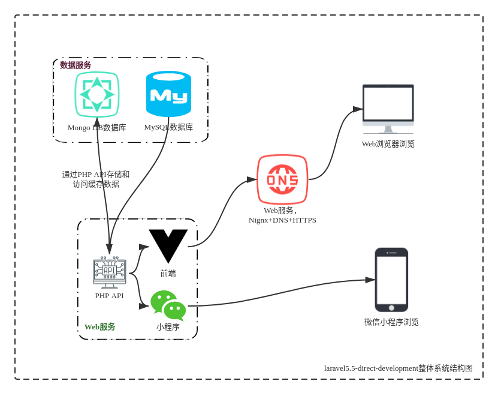
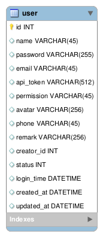
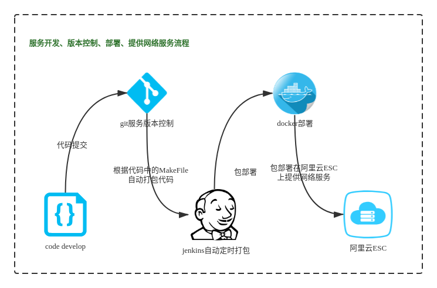

# **laravel5.5-direct-development**
------

The laravel5.5-direct-development provides API services.

## Features and design

### FullSystemArchitecture



### Features

  - Login API.
  - date API.
  
### Database design



### DevelopmentDeploymentProcess



## Prerequirements

Installing the environment requires docker 17-ce or later.

The system was tested on Docker version 17.09.1-ce, build 19e2cf6.

## Install

### Step 1 - Load docker image

```sh
$ wget http://file.achang.tech/Package/last/laravel5.5-direct-development/laravel5.5-direct-development_${VERSION}_docker_amd64.tar.gz
$ tar -xzvf laravel5.5-direct-development_${VERSION}_docker_amd64.tar.gz
$ sudo docker load --input laravel5.5-direct-development_${VERSION}_docker_amd64.tar
```

### Step 2 - Start the docker container

Start the docker container with the following command. If you want to change the port number, change the "80" to the left of "-p 80:80" to your port.If you want to use https ,yan can change the "443" to the left of "-p 443:443" to your port.

``` sh
$ sudo docker run -d --restart always \
    -p 80:80 \
    -p 443:443 \
    -v /etc/localtime:/etc/localtime \
    -v /etc/timezone:/etc/timezone \
    -e 'DB_HOST=52.162.166.103' \
    -e 'DB_PORT=3306' \
    -e 'DB_DATABASE=dashboard_v1_01' \
    -e 'DB_USERNAME=vmaxx' \
    -e 'DB_PASSWORD=555a682b426a6a305839526231514e4a79734a3272413d3d' \
    -e 'MONGO_HOST=127.17.0.1' \
    -e 'MONGO_PORT=27017' \
    -e 'MONGO_DATABASE=homestead' \
    -e 'MONGO_USERNAME=homestead' \
    -e 'MONGO_PASSWORD=secret' \
    --name laravel5.5-direct-development \
    laravel5.5-direct-development-${VERSION}
```

**Configurations:**

The following environment variable could be changed.

- 'DB_HOST': Database Host.
- 'DB_PORT': Database Port.
- 'DB_DATABASE': Database schema.
- 'DB_USERNAME': Database user.
- 'DB_PASSWORD': Hashed database password with AES.
- 'MONGO_HOST': Mongo Host.
- 'MONGO_PORT': Mongo Port.
- 'MONGO_DATABASE': Mongo schema.
- 'MONGO_USERNAME': Mongo user.
- 'MONGO_PASSWORD': Mongo database password.

### Step 3 - Verify
```sh
$ docker ps | grep laravel5.5-direct-development
123456789ab      laravel5.5-direct-development-${VERSION}      "/bin/sh -c '/var/ww…"      44 minutes ago      Up 44 minutes       80/tcp, 0.0.0.0:8083->443/tcp                       laravel5.5-direct-development

$ curl --insecure -X POST \
  https://localhost:443/api/v1/login \
  -H 'Content-Type: application/x-www-form-urlencoded' \
  -d 'name=admin&password=e10adc3949ba59abbe56e057f20f883e' \
  | grep token
try to login if success ,it ok.
```

## UnInstall

```sh
$ docker ps | grep laravel5.5-direct-development
$ docker rm -f ${container_id}
```

## Version history

| Version | Description                                             |  Date        |
|---------|---------------------------------------------------------|--------------|
| v0.1    |Initial Release with Account API, Data API               |  2018-10-26  |
|         |                                                         |              |